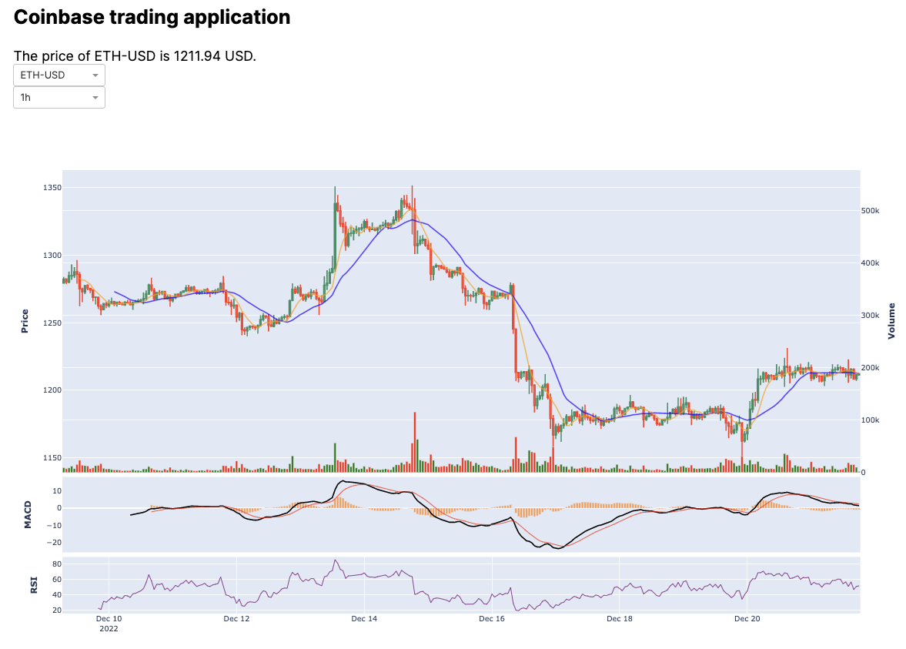

# Creating a simple charting application using the Coinbase Exchange API


For a high quality end user crypto trading experience, it’s critical to build chart visualizations into your app UI. This Python application uses Dash, an open source framework for building data visualizations, to create a simple, intuitive historical chart built from the Coinbase Public Exchange API. To learn more about Dash, check out their documentation [here.](https://dash.plotly.com/)



Before getting started, let’s walk through what we plan on building:

1.  Create a historical chart using the Coinbase Exchange API
    
2.  Display the current product and price using the Coinbase Exchange API
    
3.  Build a simple front end
    
4.  Create a single application file to orchestrate everything from a single run 
 

## 1. Creating a historical chart

Let’s create a new file in our project called `callback_graph.py` and start by importing our relevant packages:

```python
import json, requests
import plotly.graph_objects as go
import pandas as pd
from dash import Input, Output
from ta import momentum
from ta.trend import MACD
from plotly.subplots import make_subplots
```

We are importing `json` and `requests` to get and format our Exchange API request, multiple Plotly and Dash functions, `pandas` to build our DataFrame, and a package called `ta` from which we will build a few common indicators.

### Creating a DataFrame

Our first code block will initialize our Pandas DataFrame logic, which we will later feed data from our call to the Exchange API.

As we will see later, our DataFrame columns match the columns provided by Coinbase Exchange. Below, we manipulate our DataFrame several times:

First, we reverse our row order (try without this line in the final product and observe the difference). We then create a "diff" and assign this diff color coding to each row of our DataFrame in a new column called "color". We then convert our timestamp into seconds and create columns for RSI, MA20, and MA7.

```python
def create_dataframe(parse):
    df = pd.DataFrame(
        parse,
        columns=[
            'timestamp',
            'price_low',
            'price_high',
            'price_open',
            'price_close',
            'volume',
        ],
    )
    df = df.loc[::-1].reset_index(drop=True)
    df['diff'] = df['price_close'] - df['price_open']
    df.loc[df['diff'] >= 0, 'color'] = 'green'
    df.loc[df['diff'] < 0, 'color'] = 'red'
    df['timestamp'] = pd.to_datetime(df['timestamp'], unit='s')
    df['rsi'] = momentum.rsi(df['price_close'], window=14, fillna=False)
    df['MA20'] = df['price_close'].rolling(window=20).mean()
    df['MA7'] = df['price_close'].rolling(window=7).mean()
    return df
```

### Building a chart

Our next block builds our chart. 

We first declare a new chart as `fig1`, then we establish three subplot regions.  We then go about building each of those, using `plotly.graph_objects`  for candlestick, scatter, and bar charts. 

Our first subplot displays candlestick data, interpolated using the columns defined in our previous code block. We then overlay volume as a bar chart (with a secondary y axis), and add in moving average indicators plotted as lines. In each case, we utilize `add_trace` to add additional data to our first subplot.

Our second and third subplots create our MACD and RSI plots, respectively. In our previous code block, we calculated our RSI, but we wait until this section to calculate MACD values. We found this a bit easier to manage, but you may prefer to do all calculations within the DataFrame logic. 

Finally, we label all of our subplots using `update_yaxes`.
```python
def render_graph(df):
    max_volume = df["volume"].max()

    macd = MACD(close=df["price_close"], window_slow=26, window_fast=12, window_sign=9)

    fig1 = make_subplots(
        rows=3,
        cols=1,
        shared_xaxes=True,
        vertical_spacing=0.01,
        row_heights=[0.8, 0.2, 0.15],
        specs=[
            [{"secondary_y": True}],
            [{"secondary_y": True}],
            [{"secondary_y": True}],
        ],
    )
    fig1.add_trace(
        go.Candlestick(
            x=df["timestamp"],
            open=df["price_open"],
            high=df["price_high"],
            low=df["price_low"],
            close=df["price_close"],
            name="Price",
        )
    )
    fig1.add_trace(
        go.Scatter(
            x=df["timestamp"],
            y=df["MA20"],
            opacity=0.7,
            line=dict(color="blue", width=2),
            name="MA 20",
        )
    )
    fig1.add_trace(
        go.Scatter(
            x=df["timestamp"],
            y=df["MA7"],
            opacity=0.7,
            line=dict(color="orange", width=2),
            name="MA 7",
        )
    )
    fig1.add_trace(
        go.Bar(
            x=df["timestamp"],
            y=df["volume"],
            name="Volume",
            marker={"color": df["color"]},
        ),
        secondary_y=True,
    )
    fig1.add_trace(go.Bar(x=df["timestamp"], y=macd.macd_diff()), row=2, col=1)
    fig1.add_trace(
        go.Scatter(x=df["timestamp"], y=macd.macd(), line=dict(color="black", width=2)),
        row=2,
        col=1,
    )
    fig1.add_trace(
        go.Scatter(
            x=df["timestamp"], y=macd.macd_signal(), line=dict(color="red", width=1)
        ),
        row=2,
        col=1,
    )
    fig1.add_trace(
        go.Scatter(
            x=df["timestamp"],
            y=df["rsi"],
            mode="lines",
            line=dict(color="purple", width=1),
        ),
        row=3,
        col=1,
    )

    fig1.update_layout(height=900, showlegend=False, xaxis_rangeslider_visible=False)

    fig1.update_yaxes(title_text="<b>Price</b>", row=1, col=1)
    fig1.update_yaxes(
        title_text="<b>Volume</b>",
        range=[0, max_volume * 5],
        row=1,
        col=1,
        secondary_y=True,
    )
    fig1.update_yaxes(title_text="<b>MACD</b>", showgrid=False, row=2, col=1)
    fig1.update_yaxes(title_text="<b>RSI</b>", row=3, col=1)
    return fig1
```

### Getting our chart data

Our last code block is where we call the Coinbase Exchange API to provide us with relevant product candle information. 

```python
def register_graph(app):

    @app.callback(
        Output("product-chart", "figure"),
        Input("product-switcher", "value"),
        Input("gran-switcher", "value"),
    )
    def update_output(product_id_selection, granularity_selection):
        url = f"https://api.exchange.coinbase.com/products/{product_id_selection}/candles?granularity={str(granularity_selection)}"
        headers = {"Accept": "application/json"}
        response = requests.get(url, headers=headers)
        data = json.loads(response.text)

        df = create_dataframe(data)
        return render_graph(df)
```

Dash makes use of callback functions to automatically update our figure whenever its input changes. Instead of having to select inputs, hit run, and reset, this application is fully interactive and makes real time changes. 

This is accomplished using `@app.callback`, followed by at least one `Output` and `Input`. In this function, we are looking for changes to the value of `gran-switcher` or `product-switcher`, at which time we will update our chart. Simply put, when we change our product or granularity, we request new data and update our visualization. 

The function `update_output` is actually where we call the Exchange API, specifically the [Get Product Candles](exchangerestapi_getproductcandles) endpoint, which does not require an API key to request. We are updating our request url with `product_id_selection` and `granularity_selection`, which will be defined and further explained in section 3.

## 2. Displaying the product and price

Create a new file called `callback_price.py`. Here, we will write some simple code to call the Coinbase Exchange public API to report a current price.

Let's import our relevent packages:

```python
import json, requests
from dash import Input, Output
```

Next, let's add in our code block. As seen in our first script, we will again be using callbacks so that any time a product is selected, we update our displayed price.

In order to get the current price for a given product, we are using the ticker endpoint. This endpoint returns a snapshot of information about the last trade, best bid/ask, and 24h volume. More information around the ticker endpoint can be found [here](https://docs.cloud.coinbase.com/exchange/reference/exchangerestapi_getproductticker). 

```python
def register_price(app):

    @app.callback(
        Output('price-ref', 'children'),
        Input('product-switcher', 'value'))
    def update_price(product_id_selection):
        denomination = product_id_selection.split('-')[1]

        url = f'https://api.exchange.coinbase.com/products/{product_id_selection}/ticker'
        headers = {'Accept': 'application/json'}
        response = requests.get(url, headers=headers)
        parse = json.loads(response.text)
        price_val = parse['price']

        return f'The price of {product_id_selection} is {price_val} {denomination}.'

```

## Application Layout

This is where we create our front end UI, leveraging HTML and built in Dash functions. First, create `layout.py`, where we will import the following:

```python
from dash import html, dcc
```

The code that we write in order to display our front end will be highly dependent on our own front end styling. As such, consider the following as a simple example. Dash utilizes a built-in module called `dcc` to handle several interactive tools deployable within your application. Here, we are using `dcc.Dropdown` for our products as well as our granularities. Coinbase Exchange offers six granularities for product candles, all of which are in seconds. For readability, we are displaying them in standard charting units. Finally, our ids for each dropdown match values that we specified in our previous callback functions. Now, Dash will know where to look for changes to our product and granularity selections.

```python
layout = html.Div(
    children=[
        html.H1(children='Coinbase trading application'),
        html.Div(id='price-ref', style={'padding-top': 10, 'font-size': '22px'}),
        html.Div(
            id='portfolio-bal',
            style={'padding-top': 10, 'padding-bottom': 30, 'font-size': '22px'},
        ),
        html.Div(
            [
                dcc.Dropdown(
                    [
                        'ETH-USD',
                        'BTC-USD',
                        'CRV-USD',
                        'SOL-USD',
                        'CBETH-USD',
                        'CBETH-ETH',
                    ],
                    'ETH-USD',
                    id='product-switcher',
                    clearable=False,
                    style={'width': '150px'},
                ),
                dcc.Dropdown(
                    options={
                        '60': '1m',
                        '300': '5m',
                        '900': '15m',
                        '3600': '1h',
                        '21600': '6h',
                        '86400': '1d',
                    },
                    value='3600',
                    id='gran-switcher',
                    clearable=False,
                    style={'width': '150px'},
                ),
            ]
        ),
        dcc.Graph(id='product-chart', style={'width': '90%'})
    ],
    style={'padding': 30, 'flex': 1, 'font-family': 'Inter'},
)
```
## Making it run

Our final step is simple, we just create an `app.py` and write each of our other scripts through it.

We import our work from their respective scripts, associate them with our application, give our application a title, and then are ready to go!

```python
from dash import Dash
from callback_graph import register_graph
from callback_price import register_price
from layout import layout

app = Dash(__name__)
app.title = 'Insto trading app'

app.layout = layout
register_graph(app)
register_price(app)
prime_calls(app)

if __name__ == '__main__':
    app.run_server(debug=True)
```

Running the application, you should see something quite similar to the screenshot at the top of this article.

## Downloading this application

Our open source application is shared to the public on our Github [here](https://github.com/coinbase-samples/trade-whiz-py), and you may clone this repo with the following command:

```
git clone https://github.com/coinbase-samples/trade-whiz-py
```

Please note that this application contains additional functionality associated with Coinbase Prime, which was not covered. If you have a Coinbase Prime account, you can populate relevant API keys in order to place simple trades via this application. Otherwise, feel free to ignore or remove these components from the application.